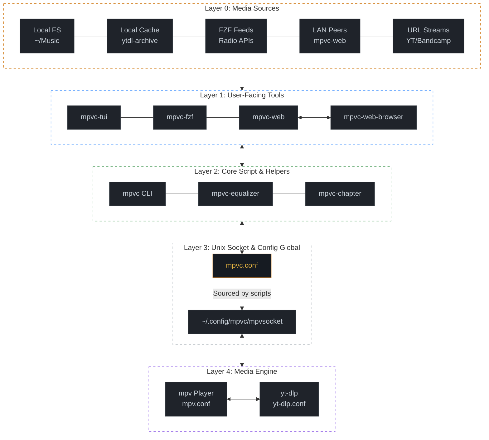

# 🎧 mpvc


[](https://gmt4.github.io/mpvc)

An elegant, lightweight, mpc-like command-line and web controller for the mpv media player, built on POSIX shell scripts and Unix sockets.

[🌐 Watch the Demo](https://gmt4.github.io/mpvc/)

## ⚡ Installation

The `mpvc-installer quickstart` automated install runs strictly in user-space (no sudo/root access). If you ever want to remove it, it leaves no messy traces, just do `mpvc-installer quickstart-rm`.


```bash
curl -fsSLO https://github.com/gmt4/mpvc/raw/master/extras/mpvc-installer;
# take your time to review the mpvc-installer for peace-of-mind
BINDIR=$HOME/bin SHELL=/bin/sh $SHELL ./mpvc-installer quickstart
```

*Prefer using package managers like Homebrew, Nix, Pkg, Gentoo, BSD or the Arch AUR? See the **[Detailed Installation steps in docs/README.md](https://github.com/gmt4/mpvc/docs/README.md#installation)**.*

---

## 🚀 Quickstart Guide

Note you can use `m/mx` instead of `mpvc/mpvc-fzf` when typing on the CLI, these are setup by `mpvc-installer`.

### 1. Base Player Controls (mpvc)
```bash
mpvc add https://somafm.com/lush130.pls # Start playing SomaFM lush
mpvc pause                              # Pause playback
mpvc play 0                             # Play playlist entry 0
mpvc vol 30                             # Set volume to 30%
mpvc next                               # Play next track in the playlist

mpvc toggle                             # Toggle playback state (play/pause)
mpvc togglev                            # Toggle video playback state (on/off)
mpvc togglei                            # Toggle idle playback state (once/always/off)
find ~/Music -name "*.mp3" | mpvc load  # Pipe local directories into the active queue
```

### 2. Interactive Search Controls (mpvc-fzf)
```bash
mpvc-fzf -f         # Launch fzf to visually manage your current playlist queue
mpvc-fzf -p 'query' # Search on Invidious/YouTube and stream matching audio
mpvc-fzf --rp       # Instantly search and play live RadioParadise audio feeds
mpvc-fzf --lofi     # Instantly search and play live Lo-Fi audio feeds
mpvc-fzf --somafm   # Browse and stream live background channels from SomaFM
```

### 3. Web Browser Control (mpvc-web)

```bash
mpvc-web -c start       # Start, and open `http://localhost:8888` in your browser
mpvc-web -c start -s1   # Start, and open `https://localhost:8443` in your browser
```

*Looking for high-level script wrappers, playlist stashes, or advanced command examples? Check out the **[Complete Usage Examples in docs/README.md](docs/README.md#git)**.*

---

## 🎛️ Companion Tools

*   **mpvc:** Core CLI interface for absolute playback, queue sequencing, and scripting.
*   **mpvc-fzf:** Interactive fuzzy-finder integration to look up tracks and stream streams.
*   **mpvc-tui:** Terminal-user-interface console to display tracks and desktop notifications.
*   **mpvc-web:** web-based-interface to manage mpvc from any device running web-browser.

*To see the full breakdown and capabilities of each tool script, read our **[Overview in docs/README.md](docs/README.md#overview)**.*

### Screenshots

<details>
<summary>mpvc-fzf running on macOS <i>(click to view screenshot)</i></summary>


</details>

<details>
<summary>mpvc-tui -T: running the mpvc TUI (with albumart) <i>(click to view screenshot)</i></summary>


</details>

<details>
<summary>mpvc-tui -T: running the mpvc TUI <i>(click to view screenshot)</i></summary>


</details>

<details>
<summary>mpvc-fzf -f: running with fzf to manage the playlist <i>(click to view screenshot)</i></summary>


</details>

<details open>
<summary>mpvc-tui -n: running with mpvc-fzf and desktop notifications on the upper-right corner <i>(click to view screenshot)</i></summary>


</details>

---

## ⚙️ System Requirements

*   **Required:** POSIX-compliant shell (`sh`), `mpv`, `socat`.
*   **Recommended:** `fzf`, `yt-dlp`.

*For package manager setups or troubleshooting tips, consult the **[Prerequisites Guide in docs/README.md](docs/README.md#requirements)**.*

---

## 🛠️ Configuration

Config file located at `~/.config/mpvc/mpvc.conf`.

*For full variable template defaults or configuring backend rules (`mpv.conf` / `yt-dlp.conf`), look over our **[Configuration in docs/README.md](docs/README.md#configuration)**.*

---

## 🗺️ Documentation

Documentation can be found in the repo, man pages, FAQ, README, and dev log:

Repo
: [https://github.com/gmt4/mpvc](https://github.com/gmt4/mpvc)

Manpages
: [https://gmt4.github.io/mpvc/man/man1/](https://gmt4.github.io/mpvc/man/man1/)

Logbook
: [https://gmt4.github.io/mpvc/logbook.html](https://gmt4.github.io/mpvc/logbook.html)

FAQ
: [https://github.com/gmt4/mpvc/docs/FAQ.md](docs/FAQ.md)

## Issues

If you encounter a bug file an [Issue](../../issues).

## Ecosystem Architecture

The following diagram maps how media inputs flow down through the user-facing tools, core scripts, and runtime configuration layers to drive the underlying playback engine:



